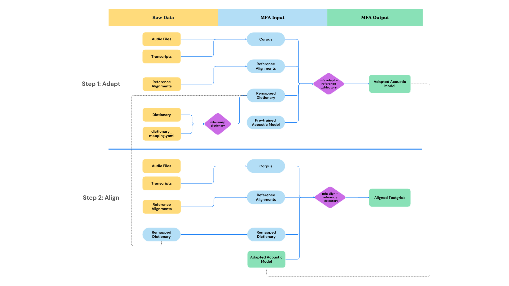
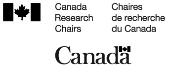

# One size does not fit all: Adapting the Montreal Forced Aligner (MFA) to your data

This is the repository for a [workshop given at the Linguistics Society of America Summer Institute 2025](https://center.uoregon.edu/LSA/2025/wednesday_events.php) on July 16th, 2025.

You can access the slides [here](static/LSA_2025_MFA_Workshop.pdf).

## Structure

* [analysis/](analysis)
  * R scripts that were used to generate summary statistics and plots
* [scripts/](scripts)
  * Python scripts that were used to generate adapted models and organize case study corpora
* [data/](data)
  * YAML mapping files for remapping dictionaries, and evaluating Buckeye alignments
* [static/](static)
  * Generated plots and slides
* [experimental/](experimental)
  * Experimental scripts for additional analyses not covered in the slides (subsets of corpora, using dictionaries based Buckeye phonetic pronunciations)

## Acknowledgement

Thank you for support from Canada Research Chair in Speech Variability.

